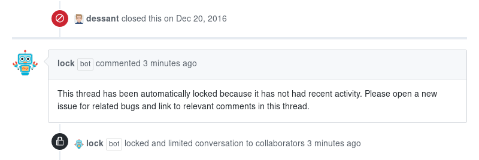

# Lock Threads

Lock Threads is a GitHub Action that locks closed issues
and pull requests after a period of inactivity.

> The legacy version of this project can be found
[here](https://github.com/dessant/lock-threads-app).



## Supporting the Project

The continued development of Lock Threads is made possible
thanks to the support of awesome backers. If you'd like to join them,
please consider contributing with
[Patreon](https://armin.dev/go/patreon?pr=lock-threads&src=repo),
[PayPal](https://armin.dev/go/paypal?pr=lock-threads&src=repo) or
[Bitcoin](https://armin.dev/go/bitcoin?pr=lock-threads&src=repo).

## Usage

Create a `lock.yml` workflow file in the `.github/workflows` directory,
use one of the [example workflows](#examples) to get started.

### Inputs

<!-- prettier-ignore -->
The action can be configured using [input parameters](https://help.github.com/en/actions/reference/workflow-syntax-for-github-actions#jobsjob_idstepswith).
All parameters are optional, except `github-token`.

- **`github-token`**
  - GitHub access token, value must be `${{ github.token }}`
  - Required
- **`issue-lock-inactive-days`**
  - Number of days of inactivity before a closed issue is locked
  - Optional, defaults to `365`
- **`issue-exclude-created-before`**
  - Do not lock issues created before a given timestamp,
    value must follow ISO 8601
  - Optional, defaults to `''`
- **`issue-exclude-labels`**
  - Do not lock issues with these labels, value must be
    a comma separated list of labels or `''`
  - Optional, defaults to `''`
- **`issue-lock-labels`**
  - Labels to add before locking an issue, value must be
    a comma separated list of labels or `''`
  - Optional, defaults to `''`
- **`issue-lock-comment`**
  - Comment to post before locking an issue
  - Optional, defaults to `''`
- **`issue-lock-reason`**
  - Reason for locking an issue, value must be one
    of `resolved`, `off-topic`, `too heated`, `spam` or `''`
  - Optional, defaults to `resolved`
- **`pr-lock-inactive-days`**
  - Number of days of inactivity before a closed pull request is locked
  - Optional, defaults to `365`
- **`pr-exclude-created-before`**
  - Do not lock pull requests created before a given timestamp,
    value must follow ISO 8601
  - Optional, defaults to `''`
- **`pr-exclude-labels`**
  - Do not lock pull requests with these labels, value must
    be a comma separated list of labels or `''`
  - Optional, defaults to `''`
- **`pr-lock-labels`**
  - Labels to add before locking a pull request, value must be
    a comma separated list of labels or `''`
  - Optional, defaults to `''`
- **`pr-lock-comment`**
  - Comment to post before locking a pull request
  - Optional, defaults to `''`
- **`pr-lock-reason`**
  - Reason for locking a pull request, value must be one
    of `resolved`, `off-topic`, `too heated`, `spam` or `''`
  - Optional, defaults to `resolved`
- **`process-only`**
  - Limit locking to only issues or pull requests, value must be
    one of `issues`, `prs` or `''`
  - Optional, defaults to `''`

### Outputs

<!-- prettier-ignore -->
- **`issues`**
  - Issues that have been locked, value is a JSON string in the form
    of `[{"owner": "actions", "repo": "toolkit", "issue_number": 1}]`
  - Defaults to `''`
- **`prs`**
  - Pull requests that have been locked, value is a JSON string in the form
    of `[{"owner": "actions", "repo": "toolkit", "issue_number": 1}]`
  - Defaults to `''`

## Examples

The following workflow will search once an hour for closed issues
and pull requests that can be locked.

<!-- prettier-ignore -->
```yaml
name: 'Lock Threads'

on:
  schedule:
    - cron: '0 * * * *'

permissions:
  issues: write
  pull-requests: write

jobs:
  action:
    runs-on: ubuntu-latest
    steps:
      - uses: dessant/lock-threads@v2
        with:
          github-token: ${{ github.token }}
```

Edit the workflow after the initial backlog of issues and pull requests
has been processed to reduce the frequency of scheduled runs.
Running the workflow only once a day helps reduce resource usage.

<!-- prettier-ignore -->
```yaml
on:
  schedule:
    - cron: '0 0 * * *'
```

### Available input parameters

This workflow declares all the available input parameters of the action
and their default values. Any of the parameters can be omitted,
except `github-token`.

<!-- prettier-ignore -->
```yaml
name: 'Lock Threads'

on:
  schedule:
    - cron: '0 0 * * *'

permissions:
  issues: write
  pull-requests: write

jobs:
  action:
    runs-on: ubuntu-latest
    steps:
      - uses: dessant/lock-threads@v2
        with:
          github-token: ${{ github.token }}
          issue-lock-inactive-days: '365'
          issue-exclude-created-before: ''
          issue-exclude-labels: ''
          issue-lock-labels: ''
          issue-lock-comment: ''
          issue-lock-reason: 'resolved'
          pr-lock-inactive-days: '365'
          pr-exclude-created-before: ''
          pr-exclude-labels: ''
          pr-lock-labels: ''
          pr-lock-comment: ''
          pr-lock-reason: 'resolved'
          process-only: ''
```

### Excluding issues and pull requests

This step will lock only issues, and exclude issues created before 2018,
or those with the `upstream` or `help-wanted` labels applied.

<!-- prettier-ignore -->
```yaml
    steps:
      - uses: dessant/lock-threads@v2
        with:
          github-token: ${{ github.token }}
          issue-exclude-created-before: '2018-01-01T00:00:00Z'
          issue-exclude-labels: 'upstream, help-wanted'
          process-only: 'issues'
```

This step will lock only pull requests, and exclude those
with the `wip` label applied.

<!-- prettier-ignore -->
```yaml
    steps:
      - uses: dessant/lock-threads@v2
        with:
          github-token: ${{ github.token }}
          pr-exclude-labels: 'wip'
          process-only: 'prs'
```

### Commenting and labeling

This step will post a comment on issues and pull requests before locking them,
and apply the `outdated` label to issues.

<!-- prettier-ignore -->
```yaml
    steps:
      - uses: dessant/lock-threads@v2
        with:
          github-token: ${{ github.token }}
          issue-lock-labels: 'outdated'
          issue-lock-comment: >
            This issue has been automatically locked since there
            has not been any recent activity after it was closed.
            Please open a new issue for related bugs.
          pr-lock-comment: >
            This pull request has been automatically locked since there
            has not been any recent activity after it was closed.
            Please open a new issue for related bugs.
```

## How are issues and pull requests determined to be inactive?

The action uses GitHub's [updated](https://help.github.com/en/github/searching-for-information-on-github/searching-issues-and-pull-requests#search-by-when-an-issue-or-pull-request-was-created-or-last-updated)
search qualifier to determine inactivity. Any change to an issue or pull request
is considered an update, including comments, changing labels,
applying or removing milestones, or pushing commits.

An easy way to check and see which issues or pull requests will initially
be locked is to add the `updated` search qualifier to either the issue
or pull request page filter for your repository:
`is:closed is:unlocked updated:<2018-12-20`.
Adjust the date to be 365 days ago (or whatever you set for `*-lock-inactive-days`)
to see which issues or pull requests will be locked.

## Why are only some issues and pull requests processed?

To avoid triggering abuse prevention mechanisms on GitHub, only 50 issues
and pull requests will be handled at once. If your repository has more
than that, it will just take a few hours or days to process them all.

## License

Copyright (c) 2017-2021 Armin Sebastian

This software is released under the terms of the MIT License.
See the [LICENSE](LICENSE) file for further information.
